# Mục tiêu bài thực hành
- Thiết lập được môi trường
- Và thực hiện một số câu lệnh với MongoDB

# Công cụ và môi trường thực hiện
- Công cụ: MongoDB compass, MongoDB Shell (mongosh)
- Môi trường: MongoDB

# Cách chạy
Copy các lệnh trong file 23521092-BT01.js xong mở MongoDB Shell (mongosh) bên MongoDB compass để chạy các lệnh theo file yêu cầu.

# Kết quả đầu ra 
- Câu 1: Tạo CSDL có tên 23521092-IE213
    - Kết quả: 
    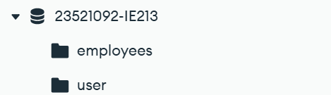
- Câu 2: Thêm documents vào collection
    - Kết quả: 
    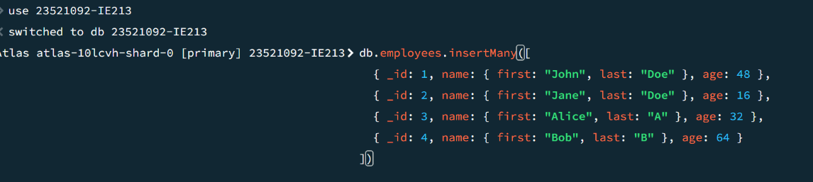
- Câu 3: 
    - Kết quả: 
    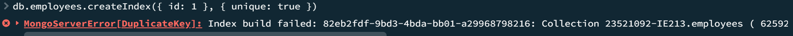
- Câu 4:
    - Kết quả: 
    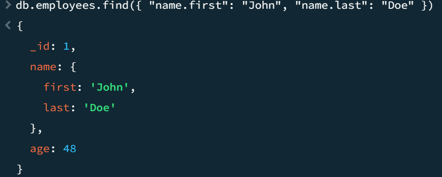
- Câu 5:
    - Kết quả: 
    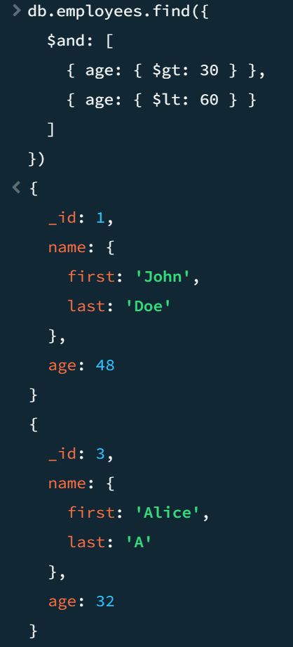
- Câu 6:
    - Kết quả:
    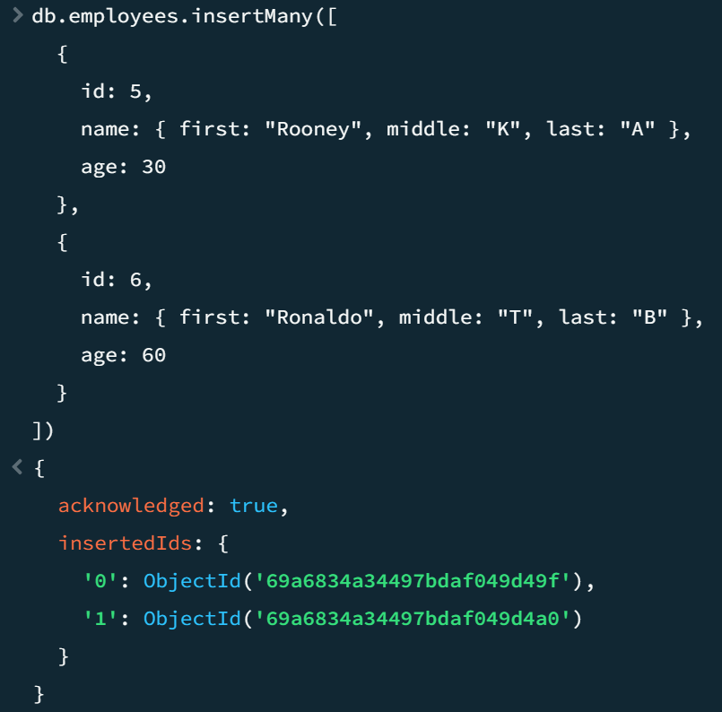
    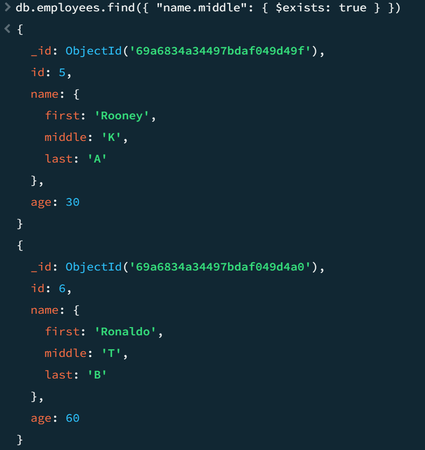
- Câu 7
    - Kết quả: 
    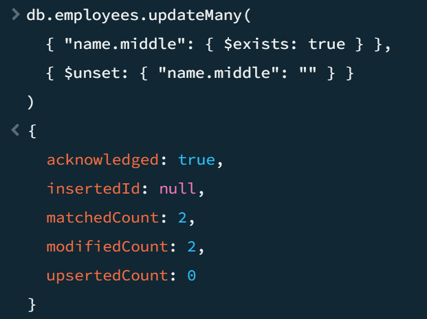
- Câu 8
    - Kết quả: 
    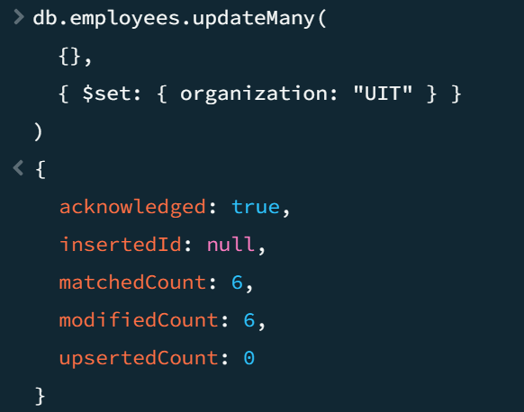
- Câu 9
    - Kết quả: 
    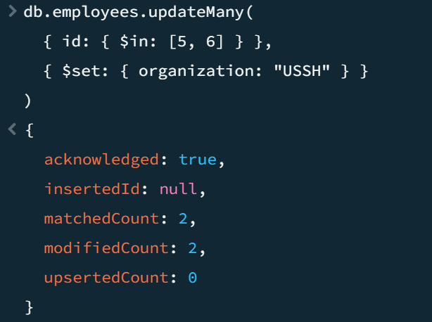
- Câu 10
    - Kết quả: 
    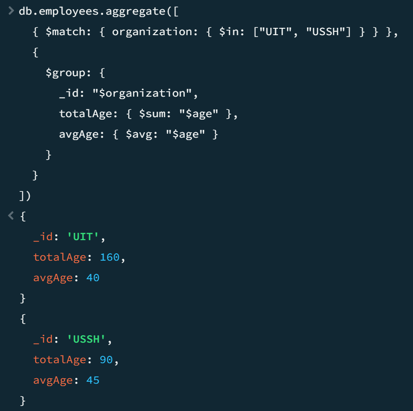

# Trình bày ngắn gọn phần chính đã thực hiện
- Tạo các lệnh và thực hiện việc thao tác các lệnh với mongoDB
- AI hỗ trợ: có sử dụng chatGPT hỗ trợ thiết lập môi trường, liên kết compass, và hướng dẫn một số câu lệnh