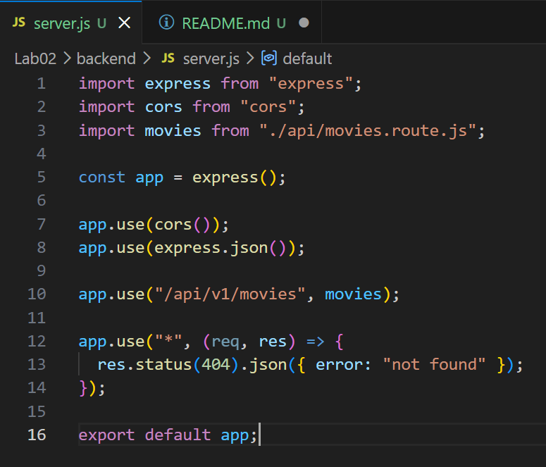
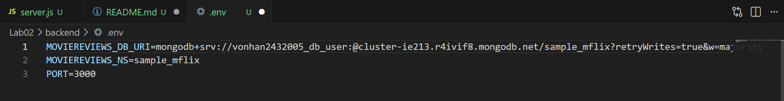
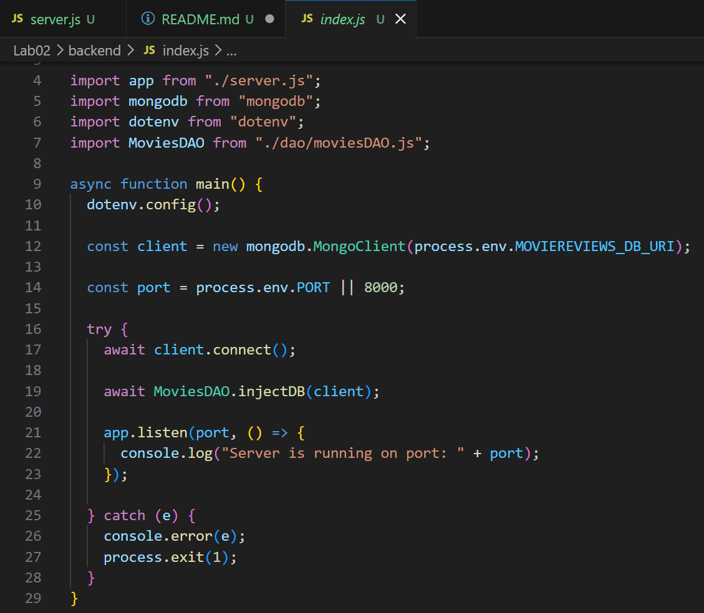
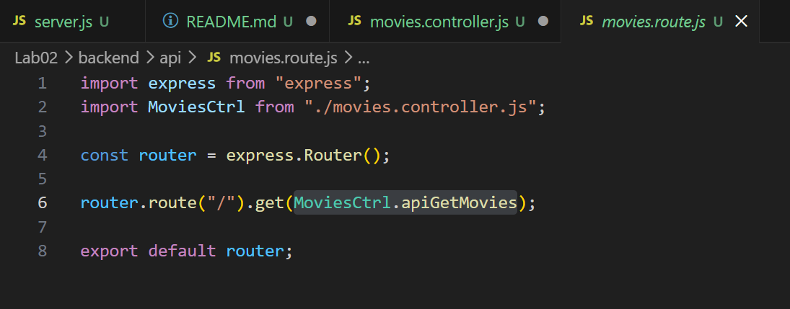
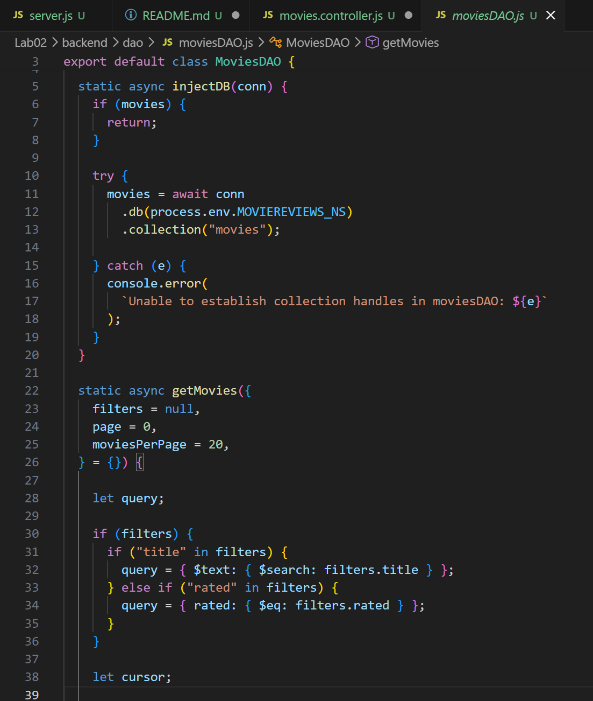
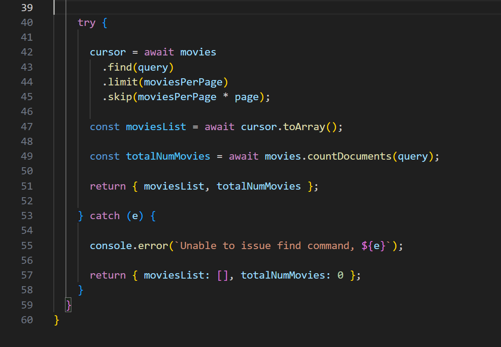
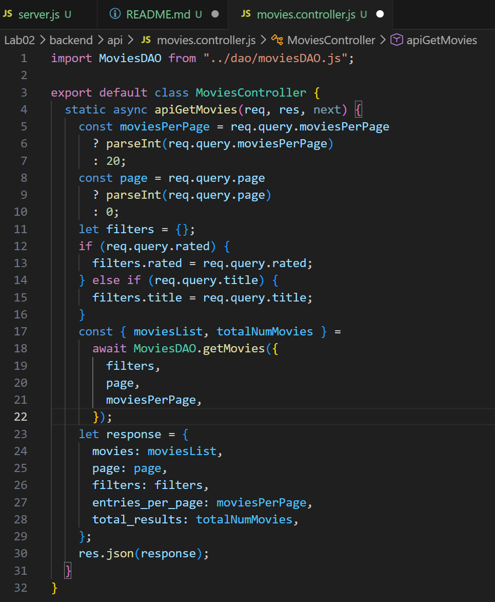
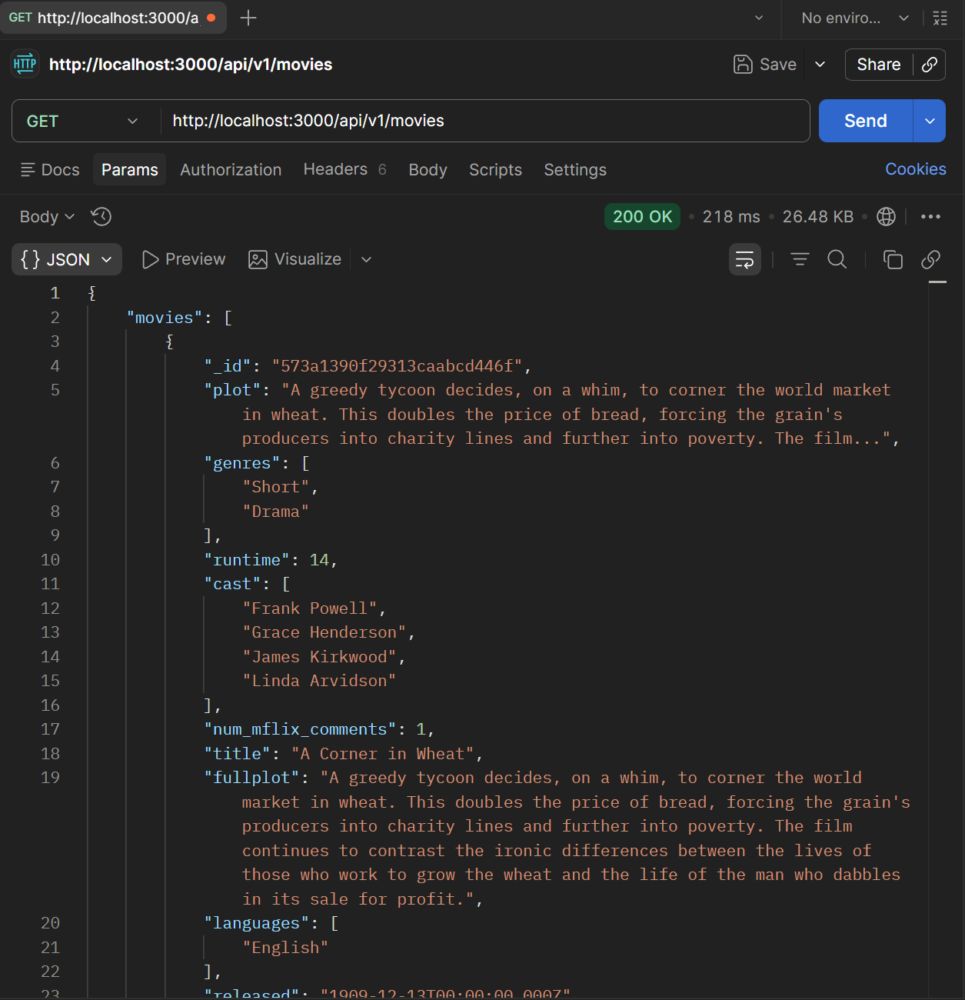

# Mục tiêu bài thực hành
- thiết lập môi trường backend với node|expressjs
- cài đặt các file dao/controller thuận tiện cho việc kết nối backend

# Công cụ và môi trường thực hiện
- cài đặt nodejs - nodejs.org
- sử dụng công cụ visual studio code
- cài đặt cây thư mục: Lab2/backend
- khởi tạo dự án với npm init 
- cài đặt cái dependency
- cài đặt nodemon tự động reload sever

- 

# Cách chạy
- đi vào thử mục Lab02
cd Lab02
- vào tiếp thư mục backend nơi lưu dự án
cd backend
- chạy với lệnh
npm run dev 

# Kết quả đầu ra 
Câu 1: Tạo sever.js 
- 

Câu 2: Tạo file .env lưu trữ thông tin biến môi trường
- 

Câu 3: Tạo tệp tin index.js để quản lý kết nối dữ liệu, khởi tạo đối tượng và chạy máy chủ
- 

Câu 4: Tạo tệp tin api/movies.route.js để xử lý các định tuyến liên quan đến ứng dụng minh họa movies
- 

Câu 5: Thiết lập file moviesDAO.js
- 
- 

Câu 6: Thiết lập Controller cho ứng dụng web gọi đến DAO
- 

Câu 7: Đưa Controller vào định tuyến => sử dụng Postman và bắt được API http://localhost:3000/api/v1/movies thành công
- 

# Trình bày ngắn gọn phần chính đã thực hiện
- Thiết được được các file Controller, Dao để xây dựng API kết nối tới MongoDB
- Cấu trúc hoạt động: Route → Controller → DAO → Database
- Công cụ hỗ trợ:
    - ChatGPT: Hỗ trợ việc code và fix lỗi do máy bị lỗi dns
