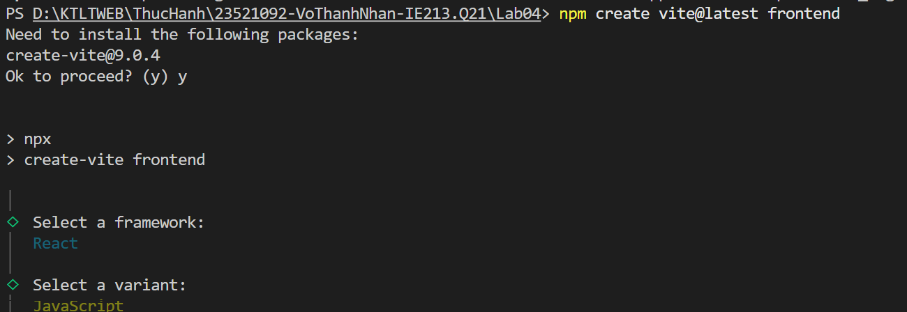
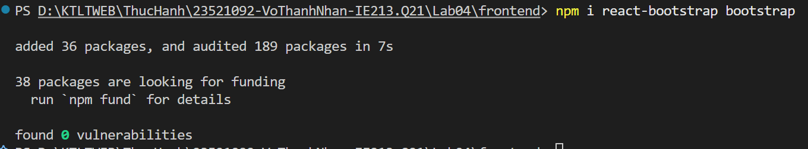
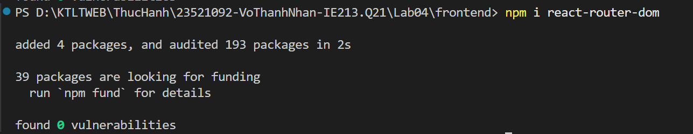
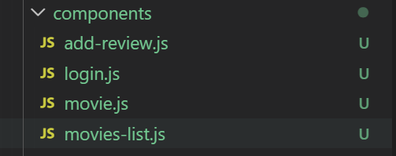
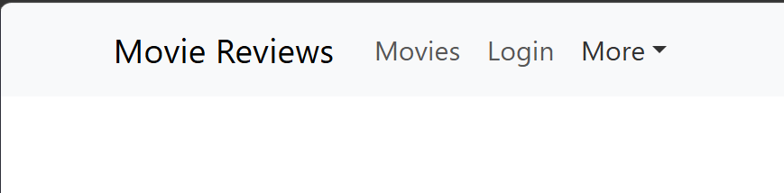
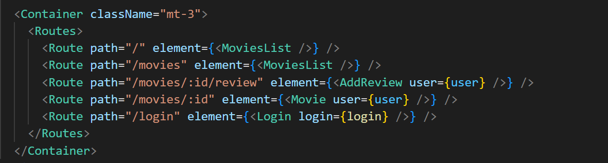

# Mục tiêu bài thực hành
- Hiểu được cách thiết lập fe trong MERN
- Xây dựng thanh Nav Header bar với sợ hỗ trợ của bootstrap

# Công cụ và môi trường thực hiện
- tạo template với react
- sử dụng công cụ visual studio code
- cài đặt cây thư mục: Lab04

# Cách chạy
- Vào thư mục Lab04/frontend
- chạy lệnh npm run dev

# Kết quả đầu ra

- Bài 1: Thiết lập nơi làm việc với fe
    - 1.1: Khởi tạo template
        - 

    - 1.2 Cài đặt bootstrap và router dom
        - 

        - 

- Bài 2: Xây dựng Navigation Header bar cho ứng dụng
    - 2.1 Navigation bar sẽ giúp người dùng định tuyến tới các nội dung của ứng dụng,
        - 

    - 2.2 2.3 Lấy Navbar Component từ React-Bootstrap và thay đổi thông tin
        - 

- Bài 3: Thiết lập các định tuyến cho các component (dùng bản mới react router v6)
    - 

# Trình bày ngắn gọn phần chính đã thực hiện
- Thiết lập được fe cơ bản
- Biết được cách tạo định tuyến tới các component trong file app
- Dùng chat gpt để hỗ trợ trong việc định tuyến theo v6