# Mục tiêu bài thực hành
- Thiết lập việc kết nối be và fe thông qua các bài thực hành trước
- Hiểu các kết nối be(lab03) và fe(lab05)

# Công cụ và môi trường thực hiện
- Cài đặt axios cho dự án hiện tại
- sử dụng công cụ visual studio code
- cài đặt cây thư mục: Lab05
- Thực hành việc kết nối qua port 8000

# Cách chạy
- Vào thư mục Lab03/backend -> npm install -> npm run dev
- Vào thư mục Lab05/frontend -> npm install -> npm run dev

# Kết quả đầu ra

- Bài 1: Kết nối tới Backend
    - Tạo lớp dịch vụ có tên MovieDataService trong thư mục .src/services/movies.js và tạo các lời gọi dịch vụ
    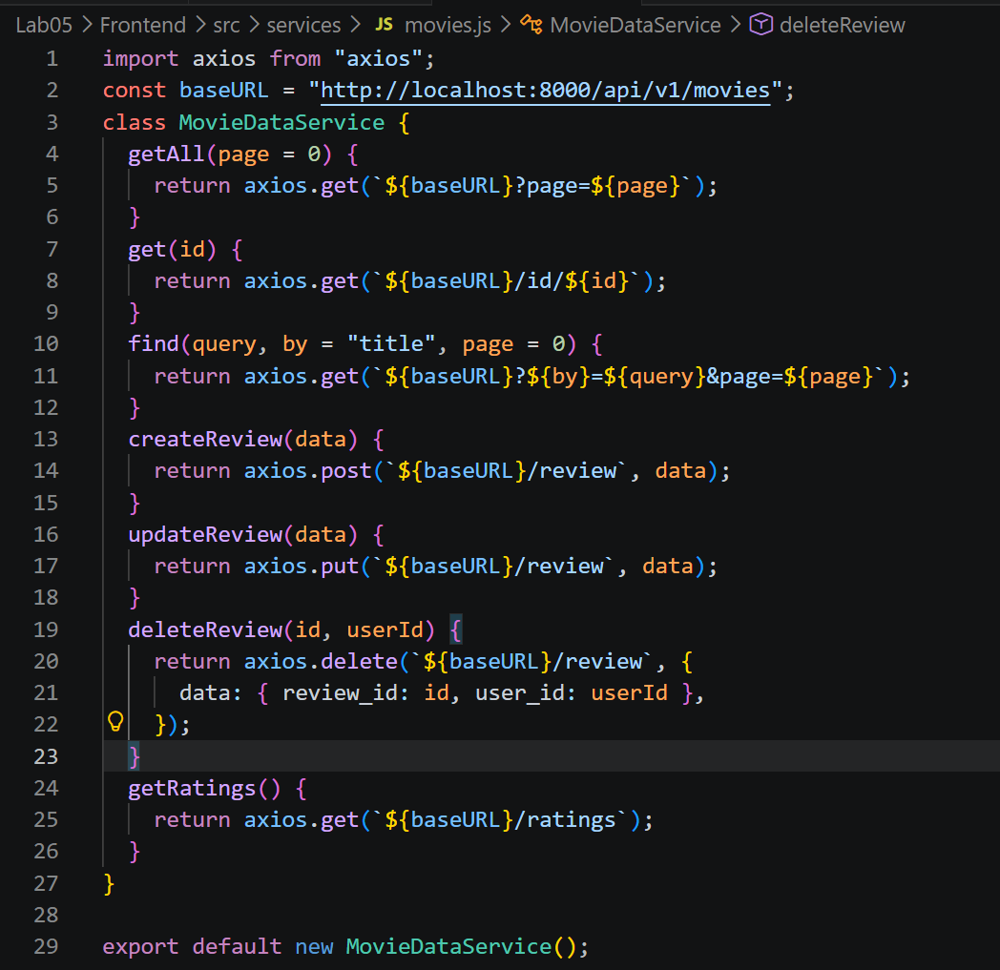

- Bài 2: Xây dựng MoviesList Component
    - 2.1 Tạo các biến trạng thái: movies, searchTitle, searchRating, ratings sử dụng useState()
    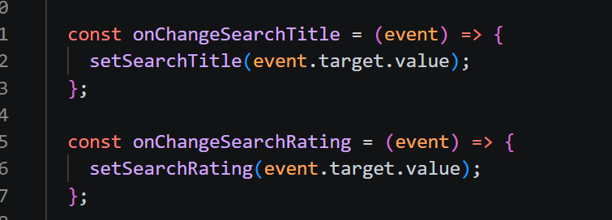

    - 2.2 Tạo 2 phương thức retrieveMovies() và retrieveRatings() để lấy thông tin movie cùng danh sách các loại ratings. Và dùng useEffect() để gọi chung sau khi giao diện kết xuất xong.
    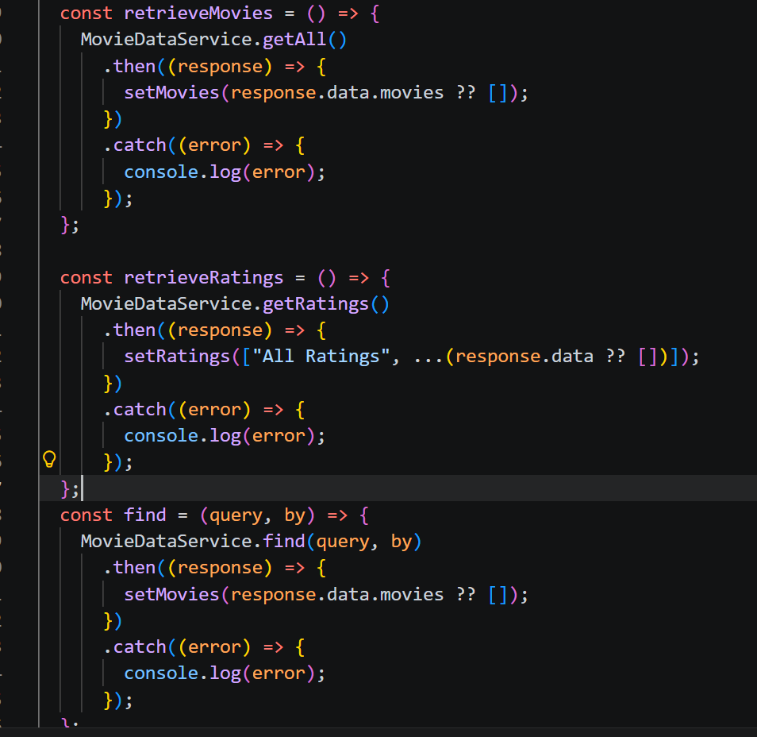

    - 2.3 Tạo 1 thanh search form gồm tìm theo title, và tìm theo rating.
    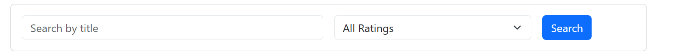

    - 2.4 Hiển thị các movie bằng <Card> của React-bootstrap.
    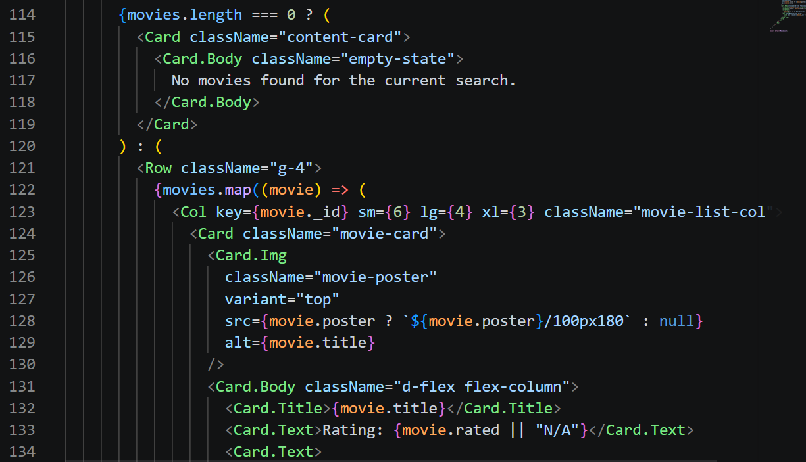

    - 2.5 Hiện thực 2 phương thức findByTitle() và findByRating() để tìm phim theo Title hoặc Rating.
    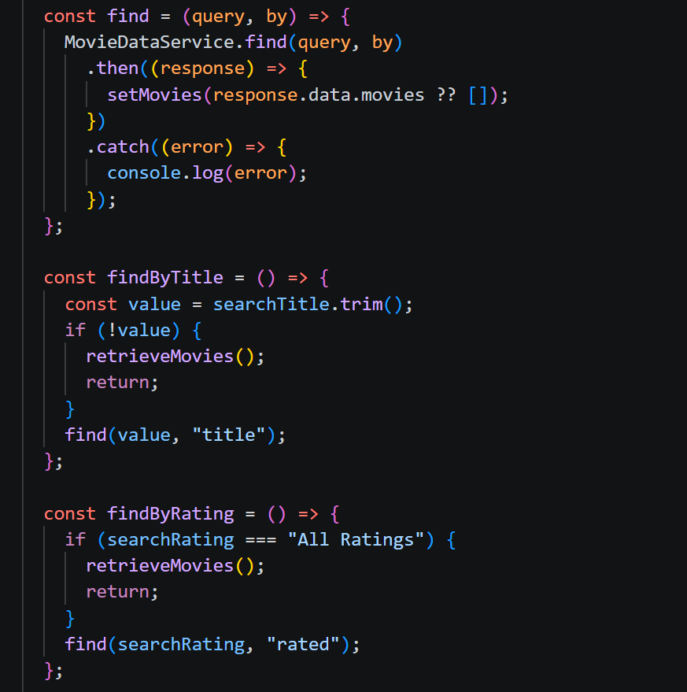

    - => kết quả đạt được
    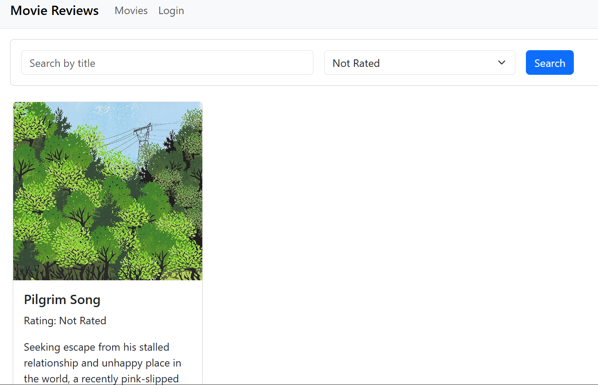

- Bài 3. Hiển thị thông tin trang movie khi nhấn vào ‘View Reviews’.
    - 3.1 Thiết lập mã nguồn cho component Movie trong tệp tin ./components/movie.js gồm:
        - Biến trạng thái movie để lưu trữ thông tin chi tiết của movie như id, title, rated, reviews.
        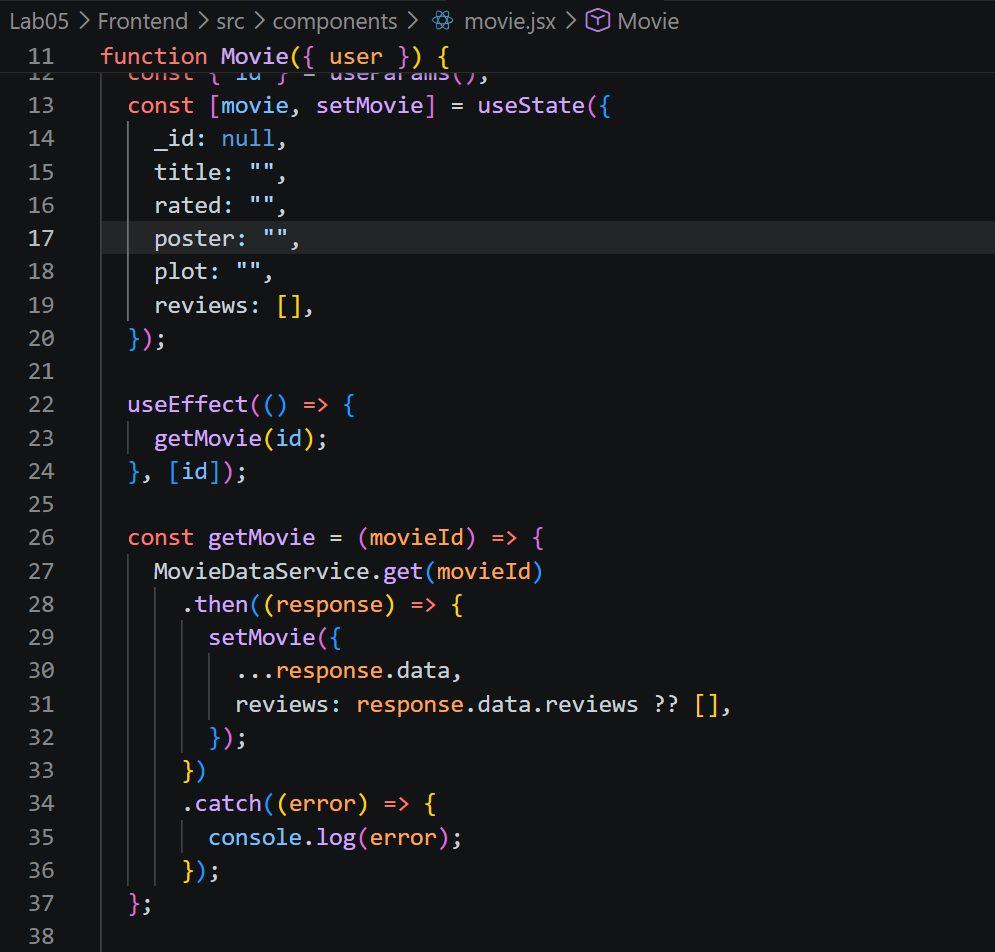

    - 3.2 Trang trí cho phần JSX trả về để hiển thị:
    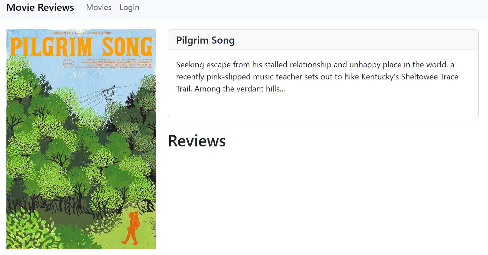
    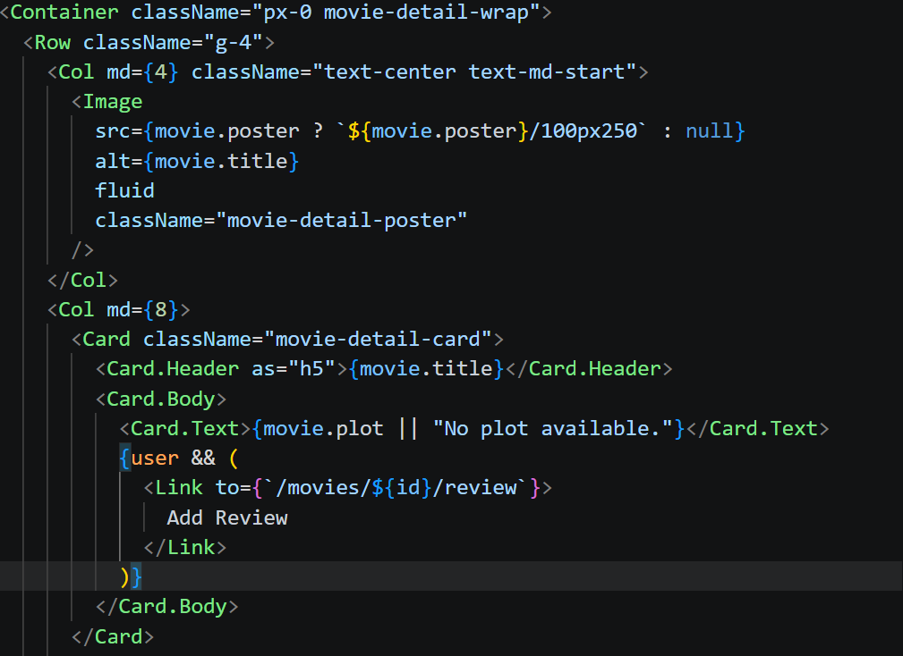

Bài 4. Hiển thị danh sách review tương ứng cho từng phim dưới phần Plot
    - Viết đoạn mã nguồn JSX cho phép hiển thị danh sách review cho phim
    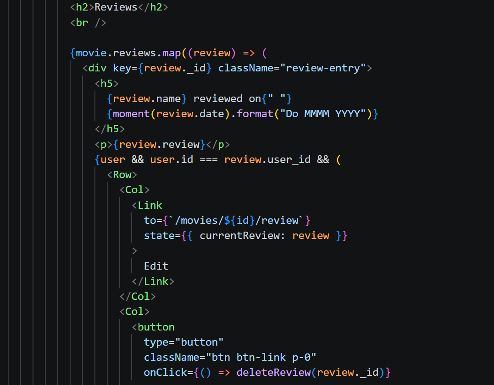
    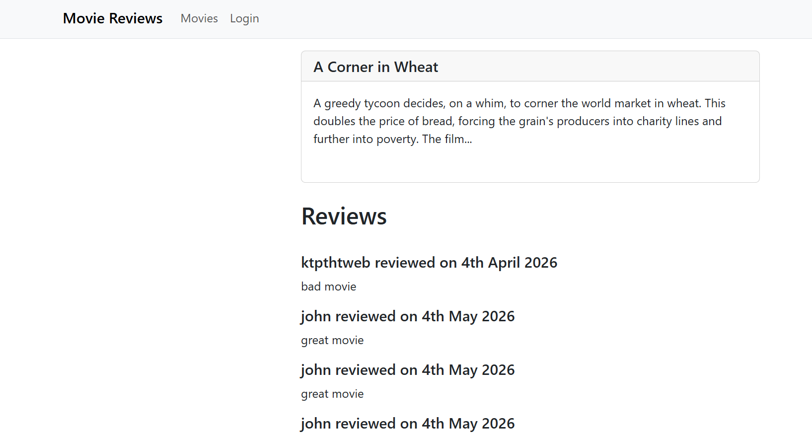
    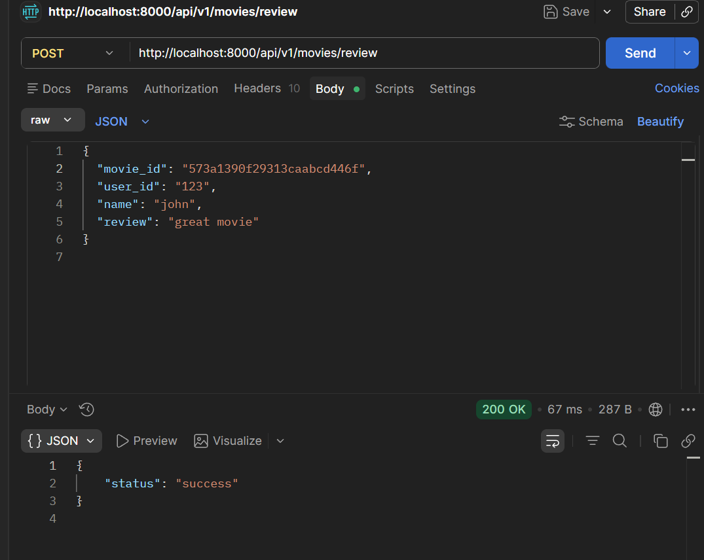

# Trình bày ngắn gọn phần chính đã thực hiện
- Thiết lập được kết nối fe và be
- Thiết lập các lời gọi dịch bên fe xuống be
- Dùng chat gpt để hỗ trợ trong việc tạo sinh kết nối, thiết kế thư mục