# Mục tiêu bài thực hành
- Thiết lập việc kết nối be và fe thông qua các bài thực hành trước
- Hiểu các kết nối be(lab03) và fe(lab06)
- Thêm/Xoá/Sửa review từ frontend.
- Lấy dữ liệu movie theo từng trang, và theo các tiêu chí tìm kiếm như dùng
Title, Rating.

# Công cụ và môi trường thực hiện
- Cài đặt axios cho dự án hiện tại
- sử dụng công cụ visual studio code
- cài đặt cây thư mục: Lab06
- Thực hành việc kết nối qua port 8000

# Cách chạy
- Vào thư mục Lab03/backend -> npm install -> npm run dev
- Vào thư mục Lab06/frontend -> npm install -> npm run dev

# Kết quả đầu ra

- Bài 1: Thêm và Sửa Review.
    - Tạo login component.
    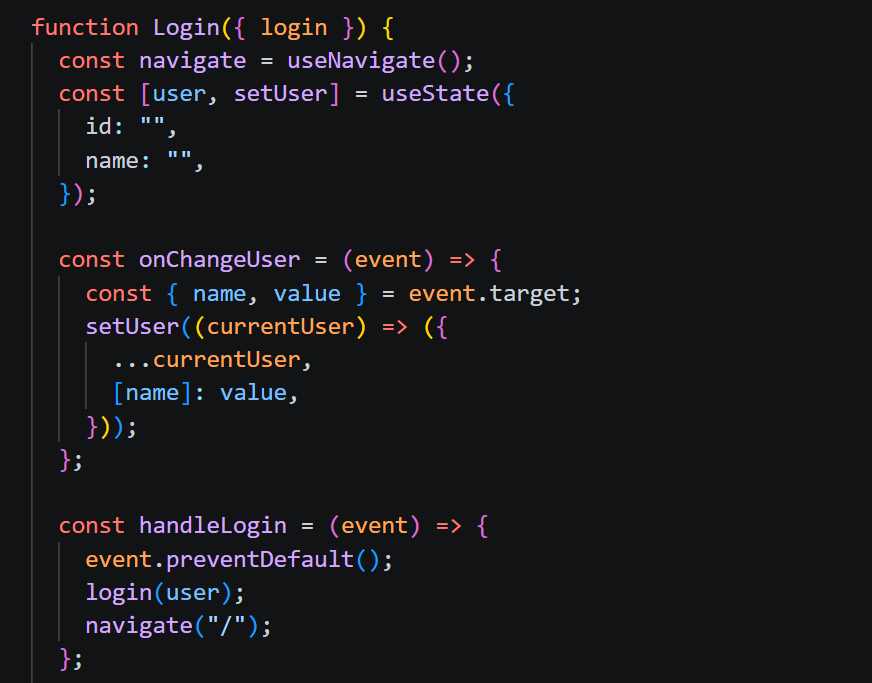
    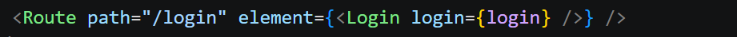
    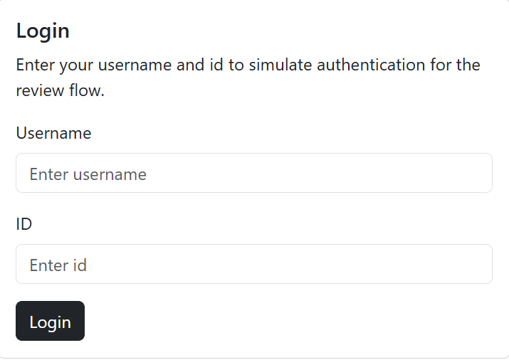
    - Thêm review
    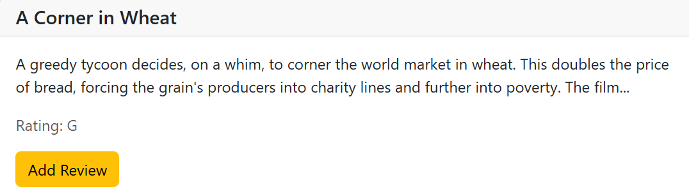
    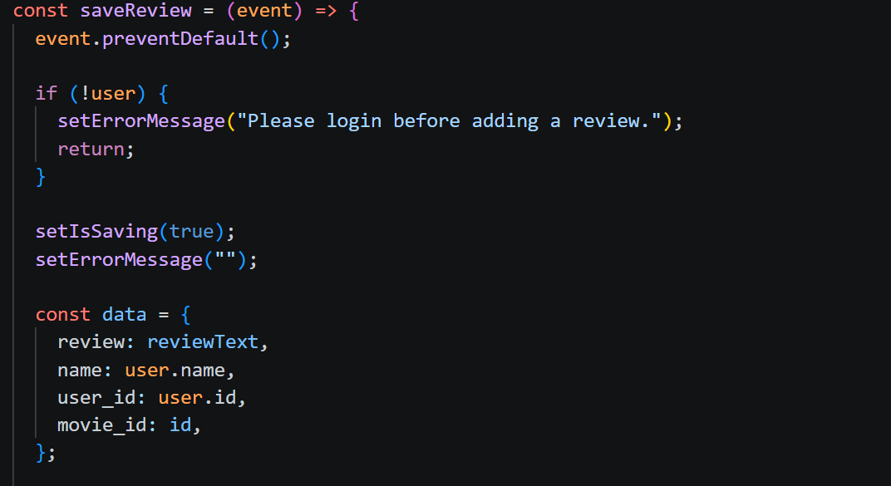
    - Sửa review
    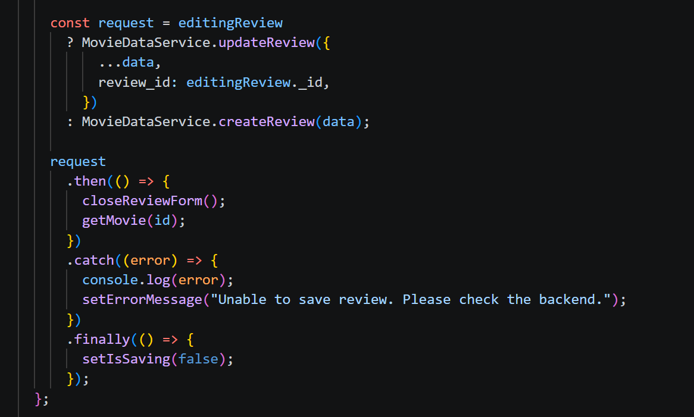
    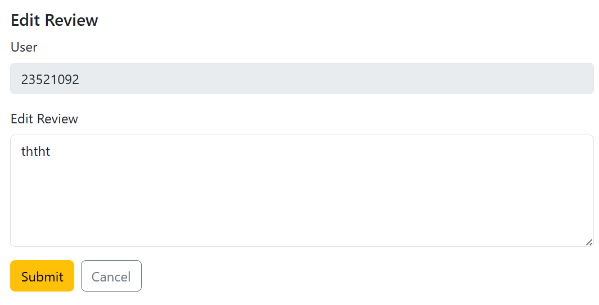

- Bài 2: Xoá review
    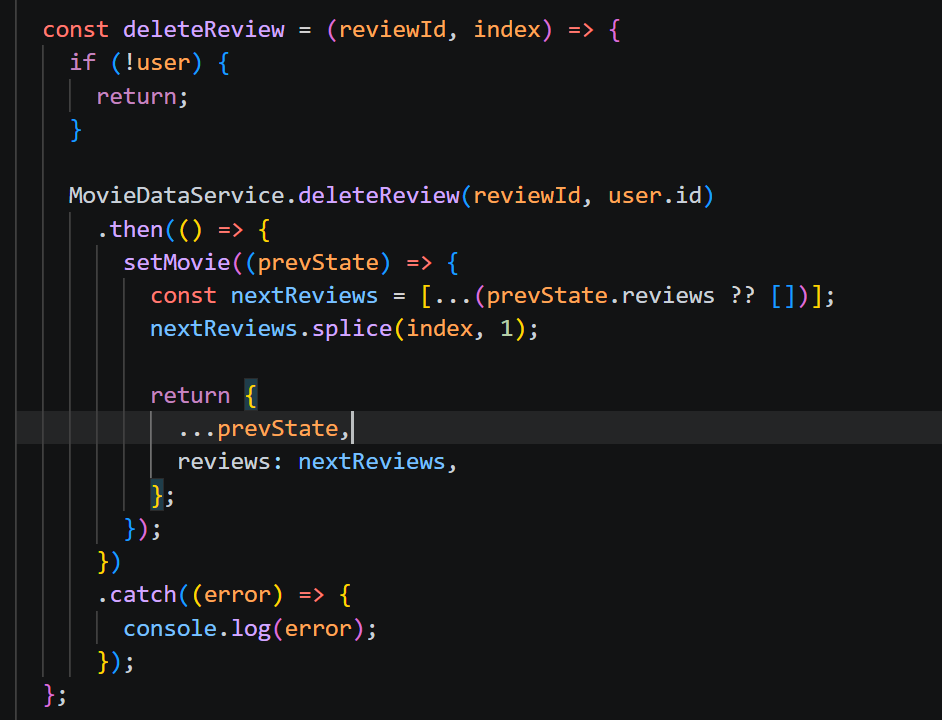
    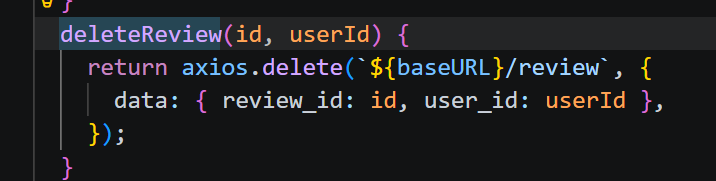

- Bài 3: Lấy dữ liệu cho trang tiếp theo
    - getAll()
    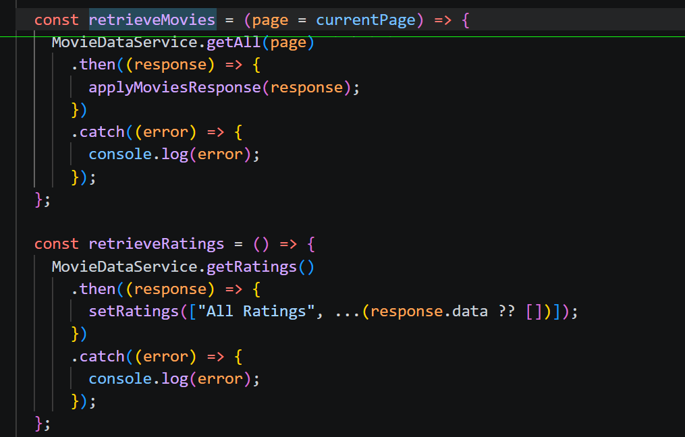
    - find()
    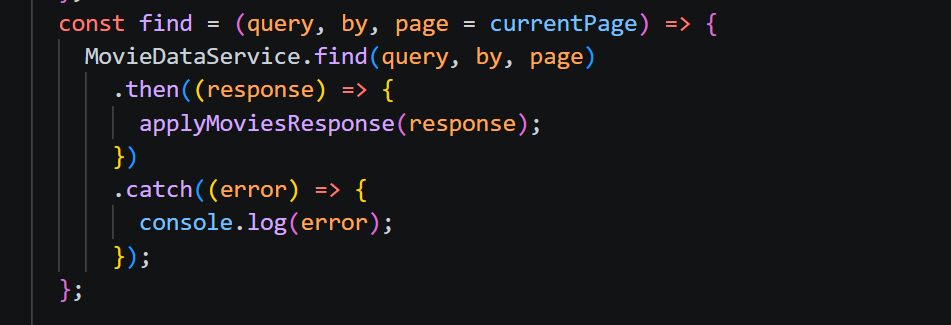
    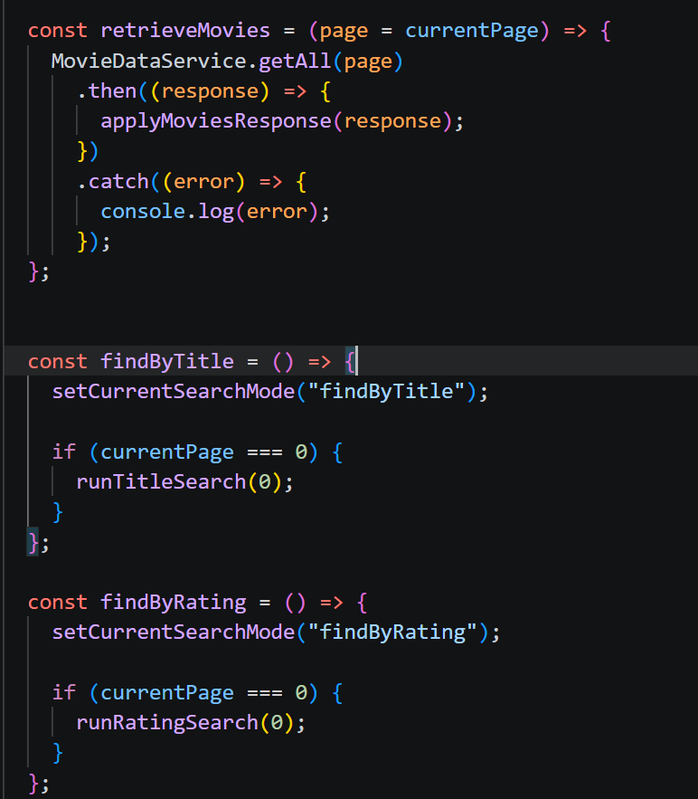
    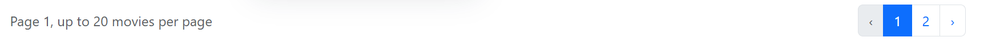

# Trình bày ngắn gọn phần chính đã thực hiện
- Thiết lập được kết nối fe và be
- Thiết lập các lời gọi dịch bên fe xuống be
- Dùng chat gpt để trong việc code các thành phần cần thiết